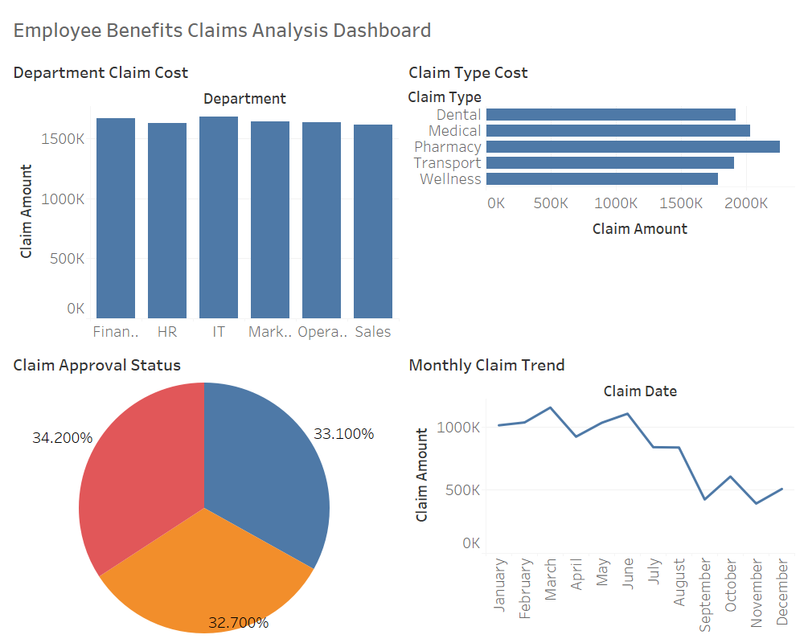

# Employee Benefits Claims Analysis
 
## Project Overview
This project analyzes employee benefits claim data to understand claim trends, department spending patterns, and approval distribution. The analysis was performed using SQL, Python, and Tableau to generate insights and build an interactive dashboard for business decision-making.
 
---
 
## Tools & Technologies
- SQL (SQLite)
- Python (Pandas, Matplotlib)
- Tableau
- Excel
- GitHub
 
---
 
## Business Questions Addressed
- Which departments generate the highest claim cost?
- Which benefit types contribute the most to overall expenses?
- What is the distribution of claim approvals, rejections, and pending claims?
- How do employee claims change over time?
 
---
 
## Project Workflow
The project follows a typical data analytics pipeline:
 
Raw Data → SQL Analysis → Data Cleaning (Python) → Data Exploration → Dashboard Visualization
 
1. **SQL Analysis**
   - Stored claim data in SQLite database
   - Used SQL queries to analyze department spending and claim patterns
 
2. **Python Data Analysis**
   - Cleaned and explored the dataset using Pandas
   - Performed aggregation and trend analysis
   - Generated summary insights for visualization
 
3. **Data Visualization**
   - Built an interactive dashboard using Tableau
   - Highlighted key insights for stakeholders
 
---
 
## Key Insights
- Certain departments contribute significantly higher claim costs.
- Medical-related benefit claims dominate overall spending.
- Majority of claims are approved while a smaller percentage are rejected or pending.
- Claim activity fluctuates over time, indicating potential seasonal trends.
 
---
 
## Dashboard

 
The dashboard visualizes:
- Total claim cost by department
- Benefit type cost comparison
- Claim approval distribution
- Monthly claim trends
 
---
 
## Repository Structure
 
```
employee-benefits-claims-analysis
│
├── data
│   ├── raw_employee_claims_data.csv
│   ├── cleaned_employee_claims_data.csv
│   └── claims_database.db
│
├── sql
│   └── claims_analysis_queries.sql
│
├── notebook
│   └── claims_analysis.ipynb
│
├── dashboard
│   └── employee_claims_dashboard.png
│
└── README.md
```
 
---
 
## Author
Dhruv Gupta
